

  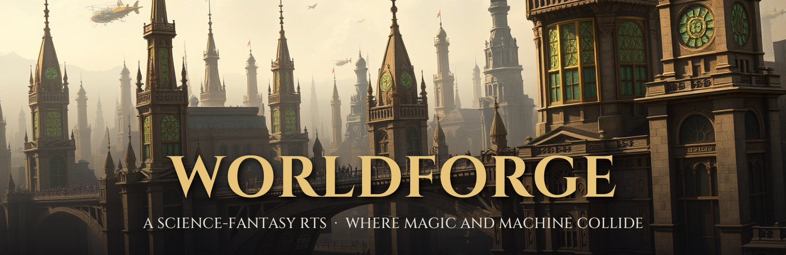

  
  
  
  

**Worldforge** is an original real-time strategy game I'm building in Godot 4, set in a world where
magic and technology amplify each other. Enchantment makes engines burn hotter; runes let bullets
punch through armor. Four societies each built themselves around one answer to how far that
should go, and the uneasy peace between them is cracking.

The game's source is private while it's in development. This repo is the gallery.

---

## ⚔️ In the game

<table>
  <tr>
    <td width="50%">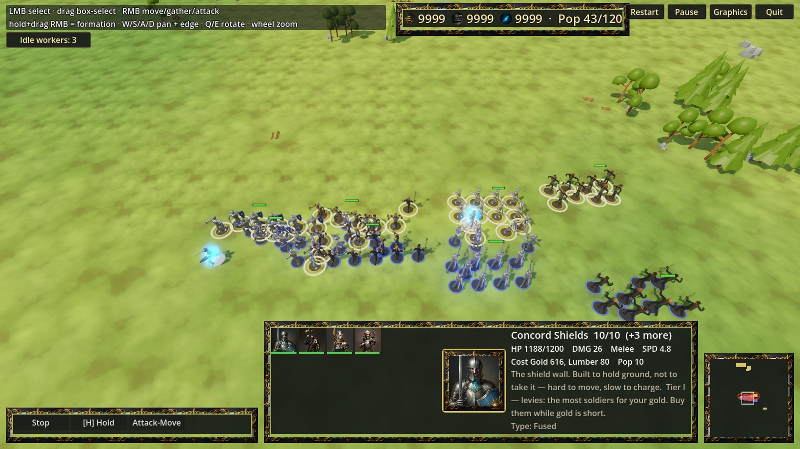 <b>Battle lines.</b> Squads fight as formations, with shield walls, pikes and shock infantry.</td>
    <td width="50%">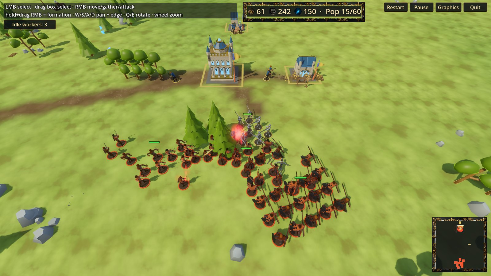 <b>Raid.</b> A Fervent warband hits a Concord town while its workers are still gathering.</td>
  </tr>
  <tr>
    <td width="50%">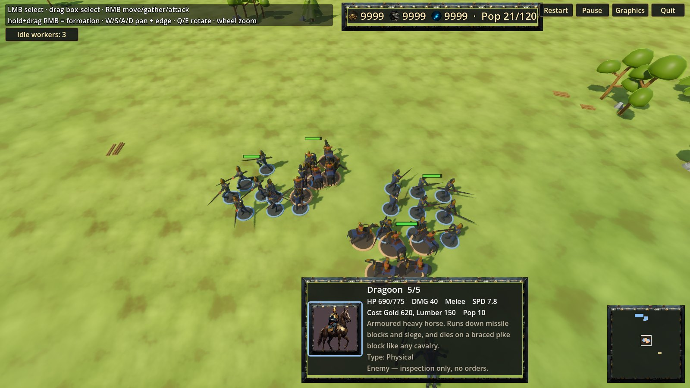 <b>Counters.</b> Dragoons charge a pike block. A braced line breaks a cavalry charge.</td>
    <td width="50%">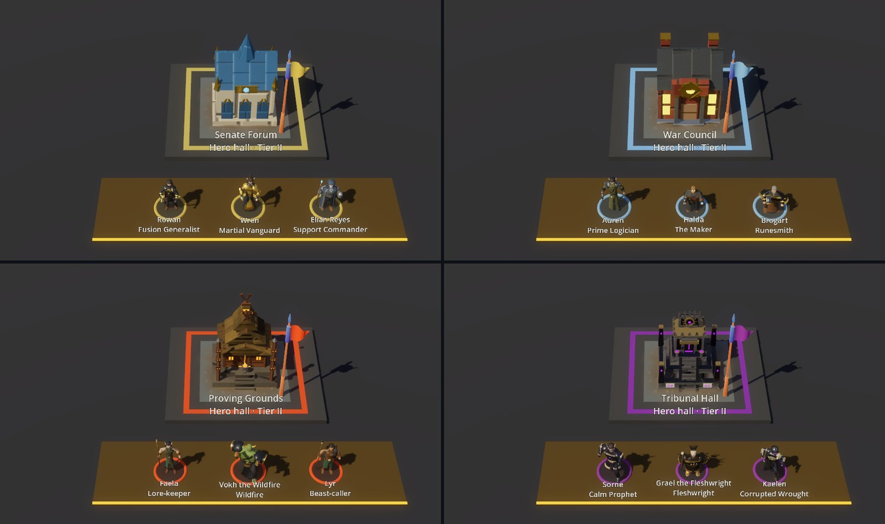 <b>Heroes.</b> Each faction fields three commanders from its own hero hall.</td>
  </tr>
</table>

## 🏰 Bases, armies & walls

Every faction has its own architecture, tiered roster and fortifications. These shots come from
the in-game **Roster** viewer.

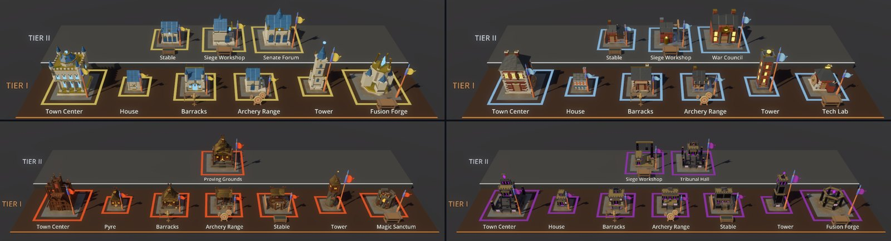
Buildings by tier: Concord · Directive (top), Fervent · Forewarned (bottom).

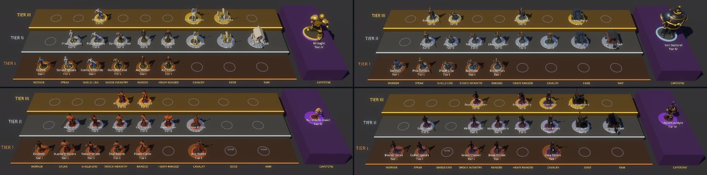
Armies: each faction fills unit slots (spear, shield line, ranged, cavalry, siege and more) across three tiers, with a capstone unit.

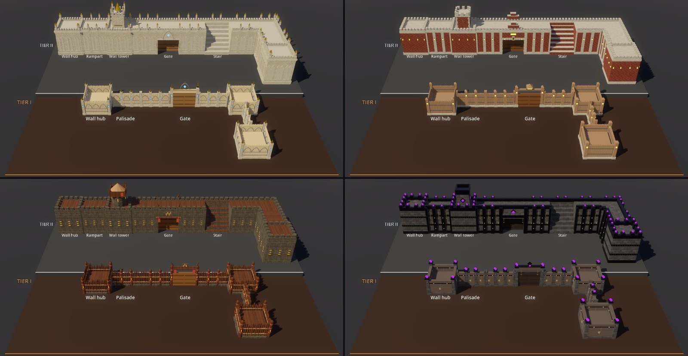
Walls: palisades in tier I, then stone ramparts, towers and gates in tier II.

## 🛡️ The four factions

**The Concord**: magic and machine in balance. Blue aether crystals in gold armatures, Gothic plate, and a senate of many houses and many races. *Order, ambition, and the throne that binds them.*
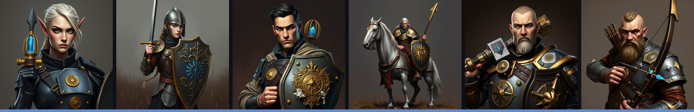

**The Directive**: technology and discipline. Every soldier is issued the same kit, stamped from one die and marked with the brass gear-wheel. Pike blocks, shield lines, rifles and iron constructs.
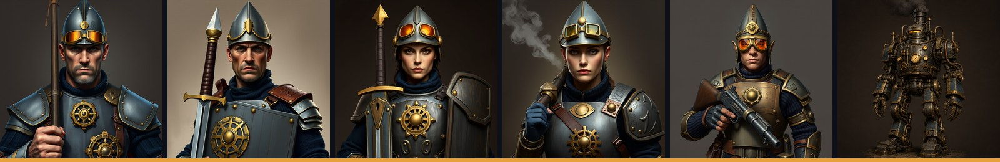

**The Fervent**: magic, volatile and proud. Their rune tattoos hold and channel their power, and their armor is partial because their skin carries the magic. *Emotion as weapon. Faith as armor.*
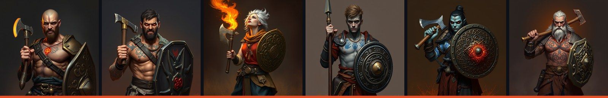

**The Forewarned**: dark and experimental. Blackened iron, eagle-beast helms that hide every face, and a violet glow. *Outcasts who remember how the world almost ended.*
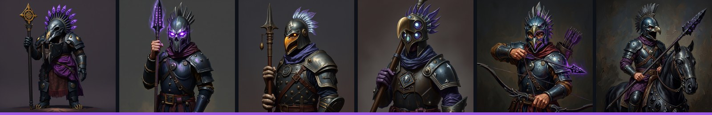

## 🖼️ Concept art

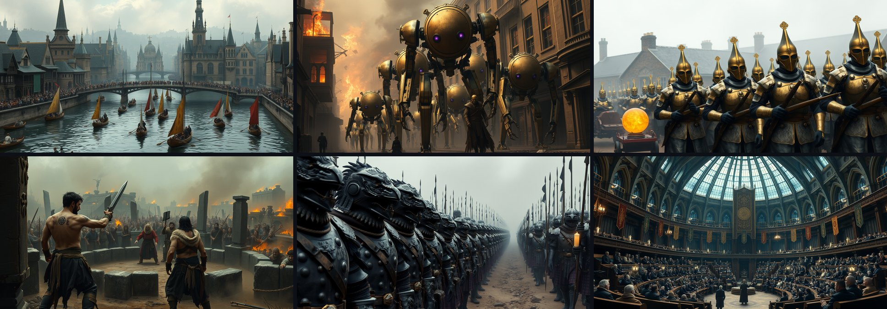

## 🔧 What's under the hood

- **Asymmetric factions.** Rosters are defined per faction, so each slot means something different
  for each side, and some factions deliberately leave a slot empty.
- **Squad combat.** Units fight in formations. An armor and ward damage model, knockback, braced
  pikes and charge impacts run on a fixed 30 Hz simulation.
- **Enemy AI** runs its own economy, builds a base and sends attack waves.
- **Headless match simulator** plays whole AI-vs-AI matches without a renderer, for balance
  sweeps across seeds.
- **Heroes, tech trees and siege** sit on top of a Tech / Magic / Fusion research system.
- **Built with a multi-agent workflow.** Claude Code, Codex and Gemini work on one repo under
  shared rules for claiming tasks, reviewing each other's work and running worktrees.

## Credits

Concept art and unit portraits were generated locally with FLUX.1, then reviewed, curated and edited. Only approved pieces appear here.
In-game 3D models are partly original and partly adapted from CC0 packs by
[Kenney](https://kenney.nl), [KayKit](https://kaylousberg.itch.io) and
[Quaternius](https://quaternius.com).

© Yehuda Stone. All rights reserved. Images are shared here for portfolio viewing only.
